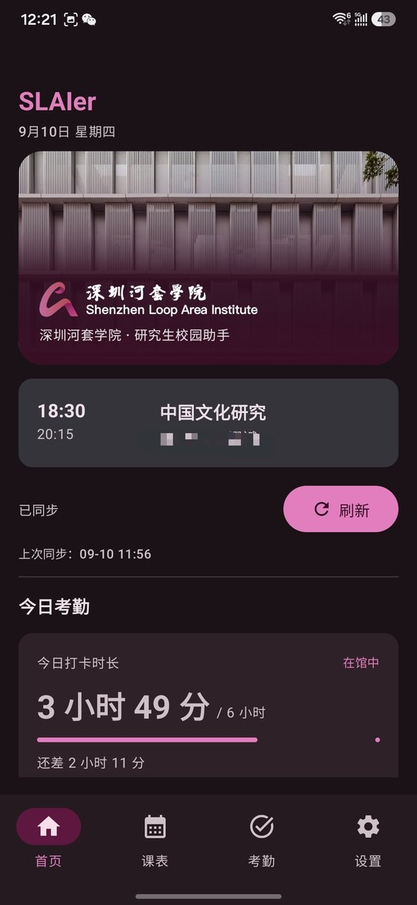
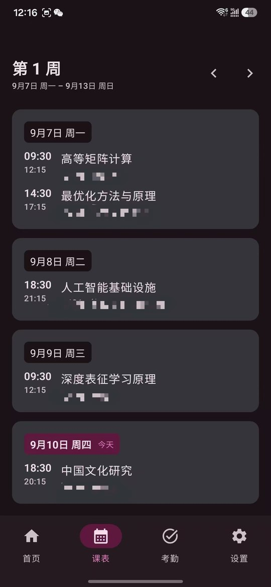
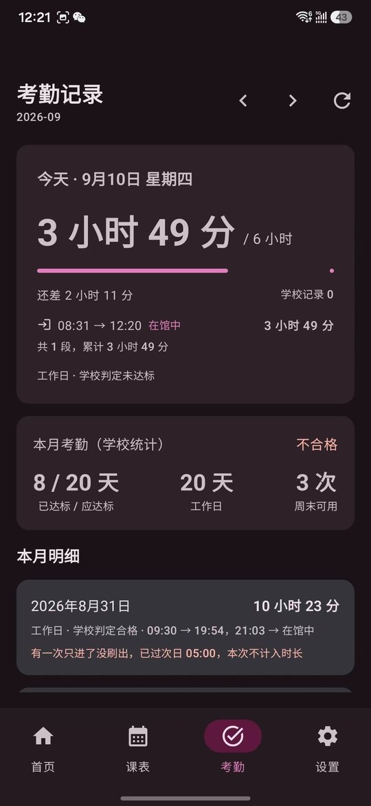

# SLAIer

深圳河套学院（SLAI）非官方研究生校园助手 —— 课表 / 考勤 / 上课提醒。

<p>
  
  
  
  
  
</p>

> SLAIer is an unofficial Android client for the Shenzhen Loop Area
> Institute's academic and student systems. It logs in through the school's own AD FS page in
> an embedded WebView, borrows that session to read your timetable and attendance natively,
> and caches everything locally so it works offline. It never stores passwords, never checks
> in on your behalf, and never talks to any server other than the school's.

---

## 截图

<!--
  三列截图。用显式的 width 而不是纯 ：
  GitHub 的表格是 `table-layout: auto`，列宽按内容算，图片尺寸不一致时就会渲染成不同大小
  （之前那张 540px 的比另外两张 1080px 的明显小一圈）。写死宽度后三列一定等宽。
  图片本身也统一成了 540x1170，在 250px 显示宽度下约等于 2x，足够清晰。
-->
| 首页 | 课表 | 考勤 |
|:--:|:--:|:--:|
|  |  |  |

> 主题与语言都可以在设置里手动指定（跟随系统 / 浅色 / 深色，跟随系统 / 简体中文 / English），
> 两者默认都**跟随系统** —— 开了深色的手机第一次打开就是深色，英文手机第一次打开就是英文。

---

## 1. 安装

**推荐：从 [Releases](../../releases) 下载 APK。**

```text
slaier-1.0.0.apk       正式版（R8 混淆 + v2/v3 签名，约 2.6 MB）
SHA256SUMS.txt         校验用
```

安装方式（三选一）：

```bash
# A. 用 adb（手机上需打开「USB 调试」）
adb install -r slaier-1.0.0.apk
```

**B. 手机上直接点开 APK** —— 把文件传到手机（微信文件传输 / 数据线 / 网盘），点击安装，
系统会提示「允许安装来自此来源的应用」。

**C. 用手机浏览器下载** —— 把 APK 放到任意可访问的地址，用手机浏览器打开并安装。

校验下载是否完整：

```bash
shasum -a 256 slaier-1.0.0.apk      # macOS / Linux
certutil -hashfile slaier-1.0.0.apk SHA256   # Windows
```

> 系统要求：**Android 8.0（API 26）及以上**，targetSdk 36。

---

## 2. 第一次使用（约 1 分钟）

```text
1. 打开 App → 首页会提示「需要重新登录」
2. 点「登录教务系统」→ 在 App 内嵌页面里完成学校的 AD FS 登录
   （账号密码只进学校的页面，App 读不到、也不保存）
3. 回到首页 → 点「刷新」→ 课表出现
4. 切到「考勤」→ 点「刷新」→ 打卡记录出现
```

**登录状态大约半小时会过期**，这是学校服务器的设定。过期后 App 会：

1. 先**静默续期** —— 沿学校的 SSO 链走一遍，如果你的 AD FS 会话还在，无需任何输入就能拿回新会话；
2. 静默续期失败才提示「需要重新登录」，点一下重新走一遍即可。

### 如果课表没出来

`设置 → 开发者诊断 → 真实刷新` 会跑**和首页刷新完全相同**的链路，打印每一步，然后直接查本地数据库。
把输出发到 Issues 即可定位 —— 现在抓不到的原因都能从这段日志里读出来。

---

## 3. 功能清单

| 功能                                                                   | 状态 |
| ---------------------------------------------------------------------- | ---- |
| 教务系统 / 学生系统登录（AD FS，内嵌 WebView）                         | ✅   |
| 今日课程、本周课表、前后翻周                                           | ✅   |
| 课表本地缓存（Room），断网可看                                         | ✅   |
| **考勤**：每日进出闸时间、当天累计时长、6 小时目标进度、本月明细 | ✅   |
| 上课提醒（标准 / 精确两种，重启后自动重排）                            | ✅   |
| 后台同步（WorkManager，6 小时）                                        | ✅   |
| 登录失效检测 +**静默 SSO 续期**                                  | ✅   |
| 可配置 API Provider（声明式接口 + 字段映射）                           | ✅   |
| 网页抓包学习（自动生成接口配置，不用改代码）                           | ✅   |
| 原生接口 → Provider → WebView 提取 → 网页兜底（四级降级）           | ✅   |
| 中文 / English 双语，默认跟随系统                                      | ✅   |
| 深浅色主题（学院官方配色）                                             | ✅   |
| 开发者诊断（全程脱敏）                                                 | ✅   |

### 关于考勤

学院要求工作日累计在馆 6 小时。App 的做法：

- **当天时长由闸机流水自己配对累加**，不是"最后出闸 − 首次进闸"——一天进出多次必须逐段相加。
- **只统计教学楼闸机**。`swipeType` 有 `教学楼` 和 `宿舍楼` 两种，把宿舍也算进去会多出通勤时间。
  实测只算教学楼时，每天分钟数与学校自己的数字**逐条吻合到秒**
  （9/1 539 分 = 08:59:11、9/7 646 分 = 10:46:35 …）。
- **只进没出会作废**：到第二天凌晨 05:00 还没刷出去，这一次进门算 0，不再累加。

---

## 4. 这个 App 是怎么连上学校系统的

不猜、不绕、不代填：

```text
登录  ──  内嵌 WebView 打开学校自己的 AD FS 页面，用户手动完成认证
          （App 不读、不存、不代填任何账号密码）
   ↓
会话  ──  WebView 的 Cookie 是唯一凭据。OkHttp 按 URL 借用（CookieManager.getCookie）
   ↓
读取  ──  用这套会话调用学校自己的接口，和浏览器发的请求一模一样
   ↓
缓存  ──  结果存进 Room，界面只读本地数据，断网也能用
```

实测确认的接口（本部署，正方 v5）：

```text
POST {sis}/yjsxt/xtgl/index_cxCurrentSemester.html?gnmkdm=index
     → {"year":"2026-2027","semester":"1","week":"1"}      ← 当前学年/学期/教学周

POST {sis}/yjsxt/kbcx/xskbcx_cxXsKb.html?gnmkdm=index
     body: localeKey=zh_CN&xnm=2026&xqm=3&zs=
     → {"kbList":[…6 行…], "xqjmcMap":{…}, "xsxx":{…}}

POST {sis}/yjsxt/kbcx/xskbcx_cxRjc.html?gnmkdm=index
     → [{qssj:"09:30", jssj:"10:15"}, … 共 9 节]           ← 节次时刻（sjkList 是空的）
```

一个值得记下来的结论：**这个部署用 HTTP `901` + 空响应体表示"未登录"**，
而不是 302。一开始把它当成"服务器拒绝/WAF 拦截"，方向错了很久。
实测：带有效 Cookie → 200 + JSON；不带 Cookie → 901 + 0 字节；UA / Referer / TLS 指纹全都无关。

---

## 5. 四级降级（核心设计）

学校的接口可能改。改的时候，App 不能整个坏掉：

```text
① API Provider（可配置 / 抓包学习）      ← 优先级最高
   声明式请求：method + url + body + rowsPath + fieldMap
   抓包学习会自动生成它；也能手工粘贴、随时改，改完不用重新编译
   ↓ 没有配置 / 配置失效
② 内置正方候选接口（NATIVE_API）
   POST {base}/kbcx/xskbcx_cxXsKb.html?gnmkdm=index
   ↓ 失败
③ WebView 提取（WEBVIEW_EXTRACT）
   让学校页面自己发请求，用注入脚本捕获它自己的 XHR 响应
   —— 不需要猜任何参数，因为参数是页面自己填的
   ↓ 失败
④ 网页兜底（WEB_ONLY）
   直接打开学校原页面，用户自己看
```

贯穿全局的一条规则：**「解析失败」绝不等于「今天没有课」**。
所有远程读取都返回 `RemoteResult`（`Success` / `SessionExpired` / `NetworkUnavailable` /
`ServerError` / `SchemaChanged`），失败永远不清缓存、不显示成空课表。

---

## 6. 从源码构建

### 环境

```text
JDK 21           （Temurin 21 已验证）
Android SDK      platform-36 + build-tools 36.0.0
Gradle           8.14.3（用仓库里的 ./gradlew 即可，会自己下载）
```

`local.properties` 里写 SDK 路径（该文件不入库）：

```properties
sdk.dir=/path/to/Android/sdk
```

### 命令

```bash
# Debug 版
./gradlew :app:assembleDebug

# Release 版（未配置签名时自动回退到 debug 签名，仍可安装）
./gradlew :app:assembleRelease

# 单元测试（154 个用例，全部不依赖 Android 框架）
./gradlew :app:testDebugUnitTest
```

### APP签名（只在你打算自己发版时才需要）

仓库里**不含任何密钥**，所以 clone 下来直接 `assembleRelease` 会得到 debug 签名的包 ——
能装，但不能作为正式版的更新分发给已有用户（Android 判断"能否覆盖安装"看的是签名，不是包名）。

怎么生成自己的密钥、怎么交给 GitHub Actions 自动发布，全部写在
[`docs/publishing.md`](docs/publishing.md) 里。

### 重新生成品牌素材

`app/src/main/res/drawable-nodpi/` 里的 logo 与风景图是从 `theme/` 的原始文件生成的：

```bash
pip install Pillow
python3 tools/make-assets.py
```

脚本里写清了每个处理步骤的原因（logo 为什么要出两份、风景图为什么只取上半部分）。

---

## 7. 安全边界

| 项                | 做法                                                                                                                           |
| ----------------- | ------------------------------------------------------------------------------------------------------------------------------ |
| 明文流量          | `usesCleartextTraffic=false` + `network_security_config` 双重禁止                                                          |
| SSL 错误          | `handler.cancel()`，**绝不** `proceed()`                                                                             |
| WebView 域名      | 严格白名单`*.slai.edu.cn`，其余交给系统浏览器                                                                                |
| 文件访问          | `allowFileAccess=false`、`allowContentAccess=false`                                                                        |
| JavaScript Bridge | **不注册任何 `addJavascriptInterface`**；提取脚本把结果写进页面全局变量，原生用 `evaluateJavascript` 读回            |
| 多窗口            | `setSupportMultipleWindows(false)`                                                                                           |
| 密码              | 不读取、不保存、不代填                                                                                                         |
| 第三方服务器      | **没有**。App 只连 `*.slai.edu.cn`，没有任何自建后端                                                                   |
| 本地存储          | 只存业务数据 + 不可逆账号 hash；`allowBackup=false`，备份规则排除数据库/偏好                                                 |
| 日志              | Release 关闭详细日志；所有输出过`Redactor`（Cookie / Token / 学号 / 密码打码）                                               |
| 权限              | 仅`INTERNET`、`ACCESS_NETWORK_STATE`、`POST_NOTIFICATIONS`、`RECEIVE_BOOT_COMPLETED`、`SCHEDULE_EXACT_ALARM`（可选） |

### 这个 App 不做什么

- ❌ 不保存、不代填、不上传校园账号密码
- ❌ 不自动打卡、不代替你完成任何考勤动作
- ❌ 不绕过学校认证（走的是学校自己的 AD FS 页面）
- ❌ 不搭建任何收集学生信息的第三方服务器
- ❌ 不做任何写操作 —— 需要写的时候打开学校原网页

---

## 8. 项目结构

```text
app/src/main/java/com/slai/campus/
├── core/
│   ├── common/        RemoteResult、Redactor、AppLanguage、TimeProvider
│   ├── database/      Room：课表 / 考勤 / 闸机流水 / 同步元数据
│   ├── network/       OkHttp 客户端 + WebView Cookie 桥
│   ├── session/       WebCookieBridge、SessionManager、SessionStore（DataStore）
│   └── web/           WebView 容器、提取脚本、域名白名单
├── domain/            纯 Kotlin：ClassOccurrence、Semester、AttendancePunch（配对算法）…
├── data/
│   ├── sis/           正方教务：DTO、解析、归一化、远程读取
│   ├── stu/           学生系统：考勤汇总、闸机流水
│   ├── provider/      声明式 API Provider + 抓包学习
│   └── schedule|attendance/   仓库实现（缓存 + 刷新编排）
├── feature/           界面：home / schedule / attendance / settings / diagnostics / provider
├── navigation/        四个标签 + 三个全屏浮层
├── reminder/          上课提醒（AlarmManager + 通知）
├── worker/            后台同步
└── ui/                品牌主题、双语 locale、通用组件
```

**分层规则**：`domain` 不依赖 `data`，`data` 不依赖 `feature`；
解析逻辑全部是纯 Kotlin，**154 个单元测试没有一个依赖 Android 框架** ——
所以那些行为在换平台时依然可验证。

---

## 9. 已知限制

1. **为深圳河套学院定制**。接口路径、字段名、`swipeType` 取值都按本部署实测写死。
   换学校需要在 `SisConfig` / `StuConfig` 里改常量，并重新做一遍抓包（用「抓包学习」功能最快）。
2. **学期第一周锚点**：正方只给"第 N 周"，不给日历日期。App 从服务端 `week` 字段反推，
   失败时按学期估算，并允许在设置里手动确认。
3. **后台同步不是精确定时**：WorkManager 最小周期 15 分钟且不保证准时；本 App 用 6 小时周期，
   只为保持缓存新鲜。
4. **课程名 / 教师名 / 学校的"合格"判定是中文**，英文界面下这几项仍是中文 ——
   它们是服务端返回的数据，不是界面文案。
5. **诊断页与接口配置页目前只有中文**（开发者工具，优先级低）。
6. **分发**：面向个人自用与小范围测试。正式向全校分发前，请先确认学校对第三方客户端
   和接口使用的政策。

---

## 10. 许可

代码以 **MIT License** 发布，见 [LICENSE](LICENSE)。

**品牌素材不在 MIT 范围内**：`theme/` 下的学院 logo 与校园照片、
以及由它们生成的图标，版权属于深圳河套学院，仅用于呈现学院自身的标识。
详见 [NOTICE](NOTICE)。如果你要 fork，请换成自己的素材，或直接删除。

本项目是学生自发编写的非官方客户端，**与深圳河套学院、正方软件、JeeSite 均无隶属或背书关系**。
